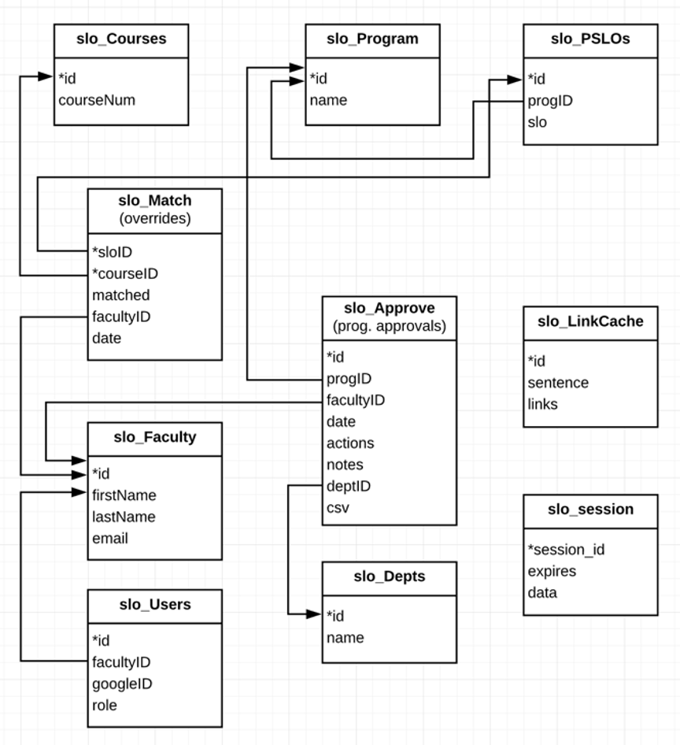

# Linguistic Analysis Tool for Program Student Learning Outcomes (SLOs)

## Summary
This tool was built for the American River College program and course student learning outcome (SLO) review, for college accreditation purposes. It replaces previous manual spreadsheets showing the connection of individual course SLOs to program-wide SLOs. This tool takes course and program data from Socrates (the program used to manage course information of this type) and uses open source tools to find the parts of speech, extract synonyms, and compare results - ultimately delivering the user a measure of the match between a particular program SLO and the course in question. Additional administrative tools allow different login levels, the ability to export data via a CSV, and manual override and review functions.

## File Structure
The file structure and general purpose of each file is as follows:

- /program_slo
    - /includes
        - extract-data.js				// get data from XML JSON obj
        - link-parse.js				// get links, synonyms & SLO matches
        - parse_xml.js				// parse XML into JSON obj
        - routes.js				// express routes
    - /public
        - /css
            - style.css			// site styles
        - /csv					// generated CSVs - don’t delete
        - /img					// associated imagery
        - /js					// front end JS
            - form.js				// customizes report submission form
            - hide-match-weights.js		// hide/show weights on analysis page
            - sticky-column.js		// make columns sticky on analysis page
    - /views
        - admin.pug				// admin report page
        - analysis.pug				// analysis report page
        - default.pug				// default wrapper for all pages
        - index.pug				// homepage, new report page
        - login.pug				// login page
        - logout.pug				// logout page
        - override.pug				// override submission page
    - /xml						// storing XML files
    - .port						// chosen port configured through apache
    - app.js						// base routing for site through express
    - logins.js					// mysql logins
    - package.json					// npm packages installed
	
## Database Structure
The table structure, fields and keys are listed in the diagram below.



If the database is moved, the login information will need to be updated inside logins.js.

## Components
### Link Grammar
Each sentence is parsed into parts of speech using the Carnegie Mellon Link Grammar tool: https://www.link.cs.cmu.edu/link/ 

This is done through the command line, so Link Grammar must be installed on the server that the Program SLO tool is running on.

Debian Linux packages can be downloaded here: https://packages.debian.org/sid/text/link-grammar

### WordNet
All verbs, nouns and adjectives are then submitted to another tool, WordNet from Princeton, which returns synonyms: https://wordnet.princeton.edu/

This is also done through the command line, so WordNet must be installed on the server running the Program SLO tool.

The specific dictionary location for WordNet (as well as a few other environment-specific variables) are specified in the command listed in link-parse.js, and must be altered depending on the server running this tool.

*Editing WordNet*

In early testing, we identified a few words which were not present in the existing WordNet dictionary. It is for this reason that we specified a particular dictionary location inside the server, to ensure that the dictionary specified was editable when needed.

This tool creates command line capabilities to edit WordNet entries: http://extjwnl.sourceforge.net/

In order to have Wordnet run with different dictionary, you need to create an environmental variable:
```
WNHOME = /home1/designhub/wordnet (wordnet dict folder loc, no trailing slash)
export WNHOME
```
Navigate to folder holding the extjwnl files and run `./ewn` and command details.
Make sure to include `-setgloss` when creating a new synset or it will not work properly.

### CSV Files
Though there may be many CSV files, don’t delete them unless you absolutely have to. Some of them will be linked to the CSV download reports on the admin page. If you delete them all, you will break these links.

If you absolutely must delete, just be careful not to delete those files that have links on the admin report page. Since those links are recorded in the database, a script could potentially be written at a later point to automatically clean this up.

### Apache & Express
This site is currently running on Apache, which includes root configuration on the Apache server to redirect all traffic from a certain port to a URL. This configuration was done by Tak Auyeung - contact him for more information.

### Forever
To make the node process run forever, rather than having to start it every time with node app.js, use the npm module forever with forever start app.js. This will make the node process run in perpetuity.

### Google Authentication
This application uses Google Sign-In for Websites to manage authentication and verification for logged in users:
https://developers.google.com/identity/sign-in/web

When API changes need to be made, this can be done in the central location inside logins.js.

### Emails (Mailjet)
Emails are sent to the submitter when a new program review is sent.

The API details for Mailjet can be updated inside the logins.js file.

### HTTPS
The site is set to run on HTTPS. This uses a self-signed certificate stored in a central location on the server - “../master/localhost.key” and “../master/localhost.crt”. These keys will need to be generated on any new environment.

## New Course Data
The XML files used as a basis for parsing this data were extracted from Socrates.

Download the course extracts and program extracts from the relevant college, and call them programs.xml and courses.xml.

After downloading, use an XML formatter like XML Tools or XML Formatter extensions for VS Code. This is because there were some closing tags missing from the original XML file, resulting in malformed results from the tool. To correct this, it is necessary to audit the original XML file to identify where the closing tags are needed, and then add. Once the XML file is formed correctly, the full list of departments should populate on the homepage.
